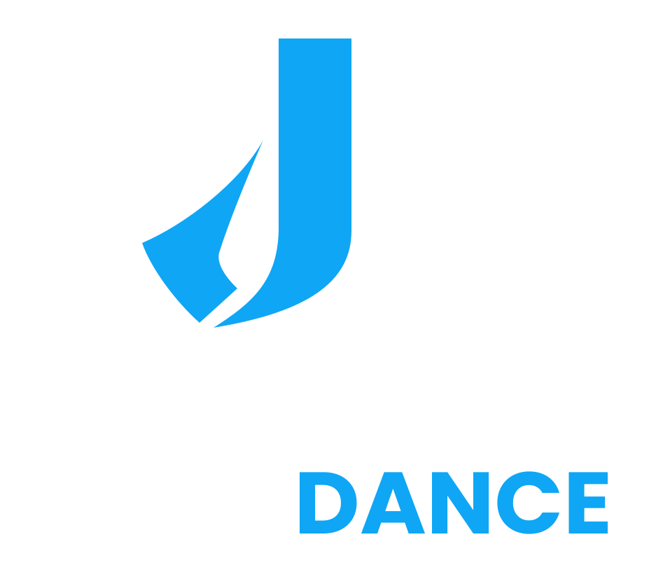
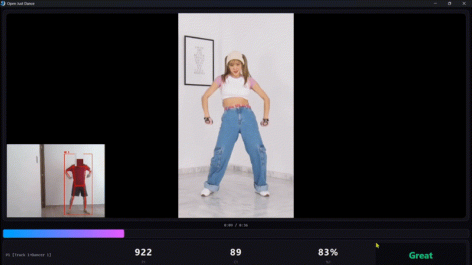
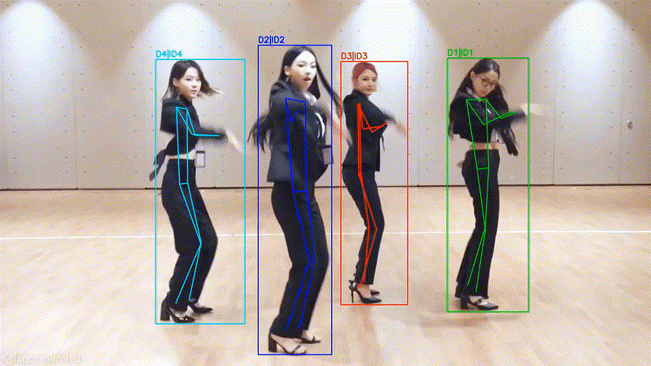
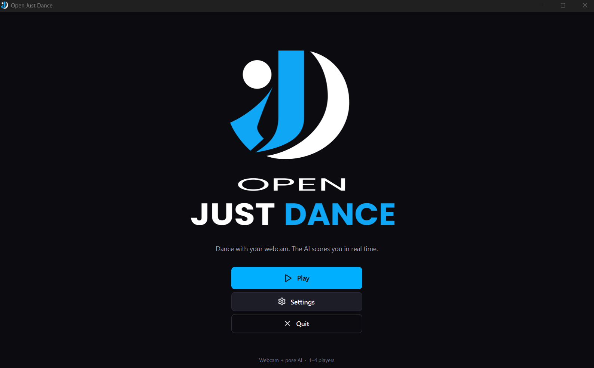
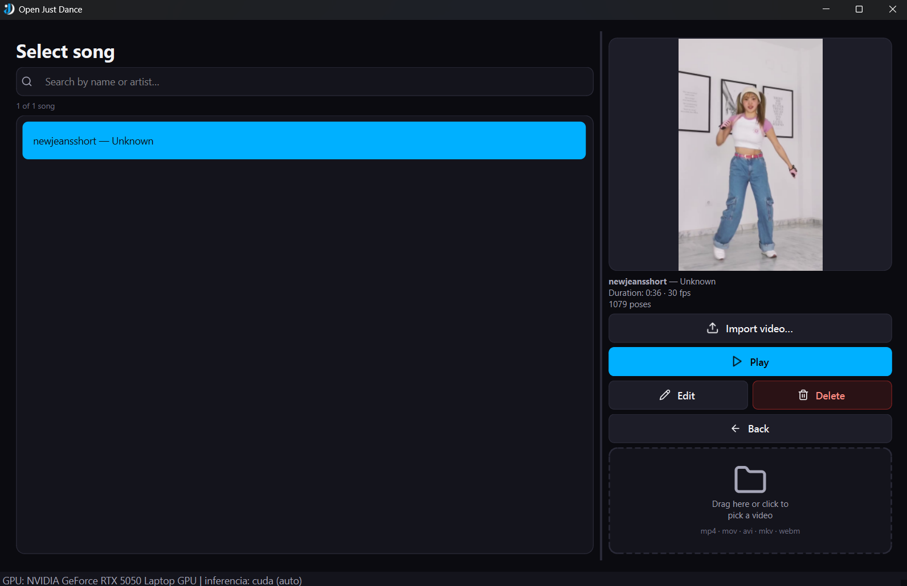
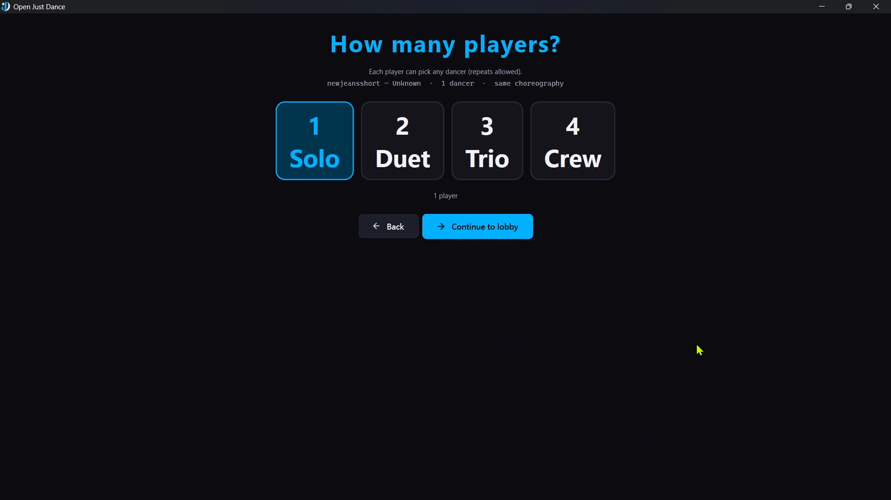
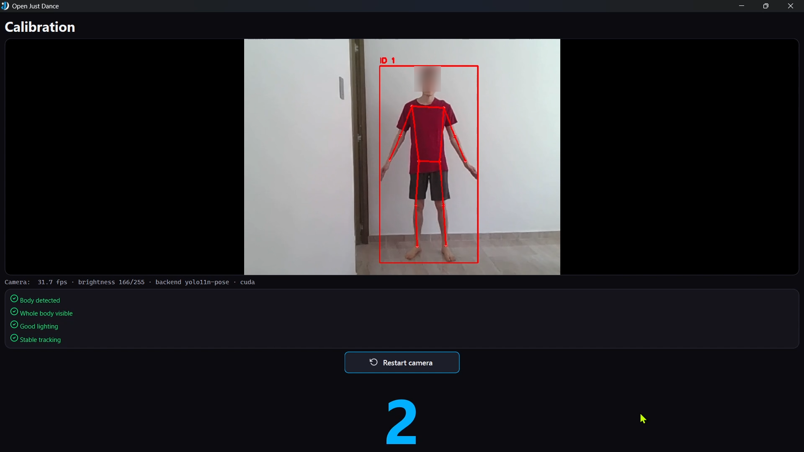
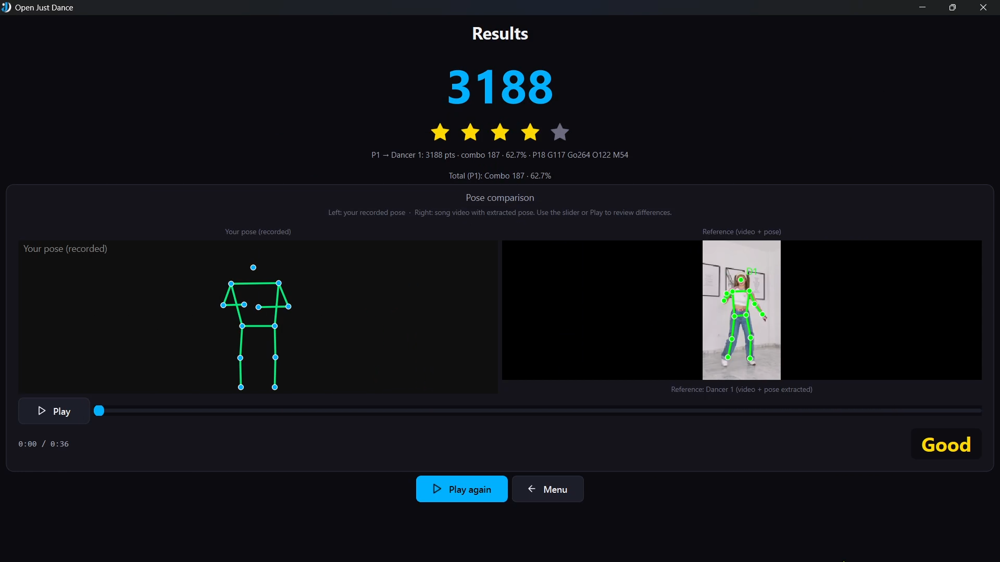
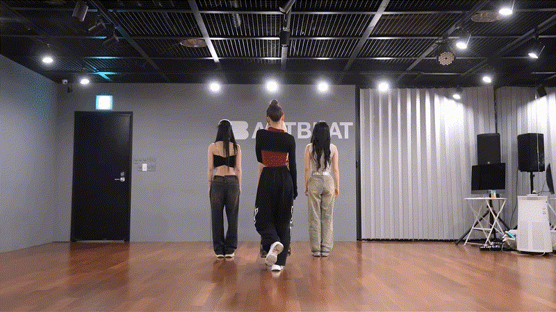

<p align="center">
  
</p>

# OpenJustDance

Open-source dance game with AI pose estimation. Turn any dance video into a playable choreography for **1–4 dancers**, then play it with a webcam: pick your dancer, follow the reference video, and get scored in real time.

Built with **PySide6 + YOLO-Pose + MediaPipe + BoT-SORT + InsightFace**.

## Demo

 4-dancer ingest 
 


 4-dancer ingest 
 

 Short clip 
 

Raw test videos live in `README-assets/` (`aespavideo.mp4`, `newjeansshort.mp4`).

video complete in [aespa - Next Level dance practice mirrored](https://www.youtube.com/watch?v=WWAl-kAtIsQ)

video complete in [NewJeans - OMG (Short)](https://www.youtube.com/shorts/fiuMgouAI4c)

video complete in [NewJeans - OMG Test (Long)](https://www.youtube.com/watch?v=gO6NWfETSkA)

## Features

- **Video-to-song importer**: any local video (`mp4/mov/avi/mkv/webm`) becomes a song folder (`song.json` + `song.mp4` + `song.mp3` + `cover.png`).
- **YOLO-first multi-dancer pipeline**: 1 forward pass for N people, persistent tracking, stable `dancer_id 0..N-1` (Hungarian assignment, no per-frame x re-sort).
- **Trackers + FaceID**: BoT-SORT with ReID appearance model by default, optional InsightFace `buffalo_l` gallery (cosine 0.38, re-check every 6 frames) so identities survive overlaps.
- **Full game flow**: `Menu → SongSelect → PlayerCount (1–4) → Join (T-pose) → DancerSelect → Calibration → Game → Result`.
- **Repeatable dancer picks**: several players can choose the same dancer; photo cards are real crops from `song.mp4` at the pose instant.
- **Fair comparison**: hip-centered, shoulder-width normalized poses (y-up), aspect-ratio compensation (vertical 9:16 vs horizontal camera), neutral empty frames.
- **Configurable**: camera, mirror, backend, inference device (`auto|cuda|cpu`), language (`en|es`), difficulty presets, smoothing, PiP vs developer view.
- **Local-only**: camera and videos never leave your machine. See [Privacy & Performance](docs/PRIVACY_PERFORMANCE.md).

## Demo Steps

<div align="center">
  
  
  
  
  
</div>


## Quickstart

Requirements: Windows + PowerShell 5.1, Python 3.11, [uv](https://docs.astral.sh/uv/). GPU (CUDA) is optional — MediaPipe on Windows is always CPU; YOLO uses CUDA when available.

```powershell
uv sync                    # install dependencies (pyproject.toml)
uv run openjustdance       # launch desktop app (PySide6)
uv run pytest              # run all tests
#====== 124 passed, 5 skipped, 1 warning in 30.50s ==========
```

Import a video from the CLI:

```powershell
uv run pose-extractor aespavideo.mp4 -o songs/aespa --title "AESPA" --artist "AESPA" `
  --estimator yolo --num-dancers 4 --yolo-model yolo11m-pose.pt `
  --yolo-conf 0.4 --yolo-iou 0.6 --imgsz 960 `
  --tracker botsort-reid --face-id --preview --poses-jsonl songs/aespa/poses.jsonl
```

Or import from the UI: `SongSelect → Import video…`, pick title/artist/dancer count, watch progress, play.

Optional WebSocket server (needs extra):

```powershell
uv sync --extra server
uv run engine-server --port 8765
```

## How it works

**Offline ingest** (`tools/pose_extractor`): `YOLO11m-Pose + BoT-SORT-ReID + FaceID` samples the video (default video fps, max 30), normalizes each dancer (`BodyNormalizer`, visibility threshold `0.15` for YOLO), smooths with EMA, and writes a time-indexed `song.json` (`openjustdance-1` mono / `openjustdance-2` multi).

**Live play** (`apps/desktop` + `engine/`): `CameraThread` runs lightweight `yolo11n-pose` (640 px) + the same tracker, pre-scales live x by `k = live_aspect / reference_aspect` before normalizing, compares with `PoseComparator` (`0.7 * position + 0.3 * angles`, bounded Kabsch ±30°), and scores with `Scorer` (`Perfect ≤ 0.05, Great ≤ 0.10, Good ≤ 0.20, Ok ≤ 0.30`).

Details: [Architecture](docs/ARCHITECTURE.md) · [Song format](docs/SONG_FORMAT.md) · [Usage](docs/USAGE.md).

## Game flow

1. **SongSelect** — search by title/artist, see `[N dancers]` badge, edit/delete, drag & drop a video to import.
2. **PlayerCount** — 1–4 players (`Solo / Duet / Trio / Crew`).
3. **Join** — hold a T-pose to claim a track (`0.6 s` hold, `0.55` min score). Manual add supported.
4. **DancerSelect** — each player picks any reference dancer (repeats allowed). Skipped when the song has 1 dancer.
5. **Calibration** — body detected → full joints → stable head. Light level is informational only.
6. **Game** — large reference video + small camera overlay (PiP), per-player rating badges, 50 ms tick, 10 Hz recording.
7. **Result** — score, stars (`≥80%: 5, ≥60%: 4, ≥40%: 3, ≥20%: 2, else 1`), per-player Perfect/Great/Good/Ok/Miss breakdown + side-by-side comparison scrubber.

Design rationale: [DESIGN.md](docs/DESIGN.md).

## Song folders

Each song is a folder (default `songs/`, overridable via Settings or `OPENJUSTDANCE_SONGS`):

```
songs/my_song/
  song.json          # time-indexed normalized poses (inline poses:[...])
  song.mp4           # reference video copy
  song.mp3           # audio via ffmpeg
  cover.png          # first-frame thumbnail
  preview_pose.mp4   # optional --preview (D{n}|ID{n} skeleton overlay)
  poses.json         # optional --dump-poses
  poses.jsonl        # optional sidecar {frame,id,box,kpts17} (UI always writes it)
  track_debug.jsonl  # optional --debug-track
```

`poses.jsonl` is a lateral export, not a field of `song.json`. Full spec: [SONG_FORMAT.md](docs/SONG_FORMAT.md).


### Errors in detection and pose estimation

When dancers have their backs turned at the start of the video and their faces are not clearly visible, errors in person, ID, and face detection may occur; therefore, it is strongly recommended to use videos where the dancers' faces are visible from the very beginning.This error can be seen here, and it needs to be improved or corrected in the future.




## Settings

Stored at `%APPDATA%/openjustdance/settings.json`. UI exposes: camera picker, mirror (default on), pose backend (`auto|mediapipe-cpu`), inference device (`auto|cuda|cpu`, default `auto`), language (`en|es`, default `en`), difficulty presets, smoothing (`0..1`, default `0.5`), developer view (PiP vs side-by-side).

Difficulty presets (`apps/desktop/settings.py`):

| Preset | Perfect | Great | Good | Ok | Angle weight |
|---|---|---|---|---|---|
| Easy | 0.20 | 0.32 | 0.48 | 0.62 | 0.0 |
| Medium | 0.15 | 0.28 | 0.42 | 0.55 | 0.15 |
| Hard | 0.06 | 0.12 | 0.22 | 0.35 | 0.30 |

Default live thresholds are `0.05 / 0.10 / 0.20 / 0.30` (`engine/score_engine/scoring.py`).

## Local weights (not committed)

| File | Use | Notes |
|---|---|---|
| `yolo11m-pose.pt` | Ingest / multi (accurate) | Default when `--yolo-model` is omitted in multi |
| `yolo11n-pose.pt` | Live webcam (lightweight) | Hardcoded in `CameraThread` |
| `yolo26n-pose.pt` | Alt backend alias | Registered as `yolo26n-pose` |
| `yolo26n-reid.onnx` | BoT-SORT ReID appearance | Referenced by `botsort-reid*.yaml` |

`*.pt` is git-ignored; `*.onnx` currently is not (documented as-is). Test videos (`*.mp4`) are also ignored. Never commit weights or videos.

## Project structure

```
apps/desktop/        PySide6 UI: main, controller, threads (CameraThread+SharedState),
                     settings, i18n (en/es), workers (cancelable import), ui/* views
engine/pose_engine/  camera, detector (HOG+NMS+T-pose), multi (YOLO-first pipeline),
                     faceid (FaceGallery buffalo_l), hardware (gpu_info),
                     skeleton (DANCER_PALETTE_BGR), backends/, trackers/*.yaml
engine/tracking/     player_manager (TrackID<->PlayerID<->DancerID), tracker
engine/normalize_engine/  normalizer, smoother
engine/score_engine/      comparator (compare_space_prescale), scoring
engine/timing_engine/     synchronizer (frame_at / dancer_pose_at by time)
shared/dance_format/      models (openjustdance-1/2), loader
tools/pose_extractor/     extract (ExtractOptions), cli, proc_entry (UI child)
services/engine_server/   optional aiohttp WebSocket server
tests/               pytest, 18 files (pure + YOLO/video-gated)
songs/               generated songs (ignored)
```

## Documentation

- [Architecture](docs/ARCHITECTURE.md) — pipelines, backends, tracking, scoring math.
- [Design](docs/DESIGN.md) — UX flow, views, theming, i18n, palette.
- [Usage](docs/USAGE.md) — playing, importing, full CLI reference.
- [Song format](docs/SONG_FORMAT.md) — `song.json`, `poses.jsonl`, normalization.
- [Contributing](docs/CONTRIBUTING.md) — conventions, workflow, PRs.
- [Development](docs/DEVELOPMENT.md) — setup, tests, troubleshooting.
- [Privacy & Performance](docs/PRIVACY_PERFORMANCE.md) — local-only, GPU/CPU, weights.

## Contributing

See [CONTRIBUTING.md](docs/CONTRIBUTING.md) and [DEVELOPMENT.md](docs/DEVELOPMENT.md). Quick rules: engine code must not depend on PySide6 (Qt lives only in `apps/`), comparison is always by time never by frame index, empty frames are neutral.


### 📄 License

This project is licensed under the MIT License - see the [LICENSE](LICENSE) file for details.

---

## 👨‍💻 Author / Autor

**Diego Ivan Perea Montealegre**

- GitHub: [@diegoperea20](https://github.com/diegoperea20)

---

Created by [Diego Ivan Perea Montealegre](https://github.com/diegoperea20)